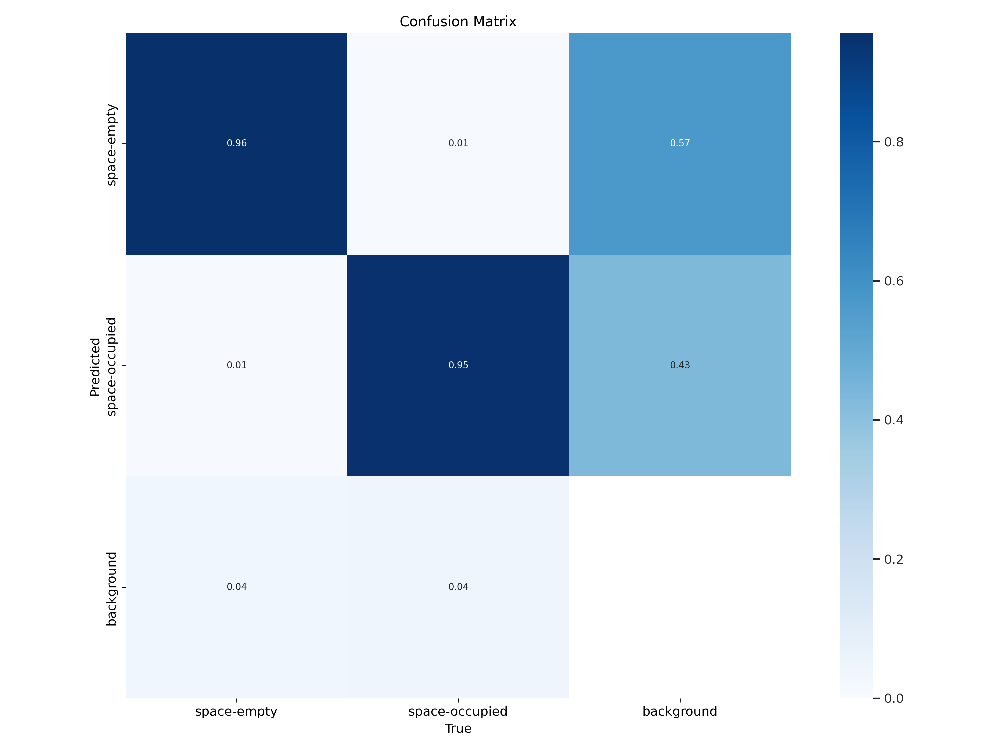
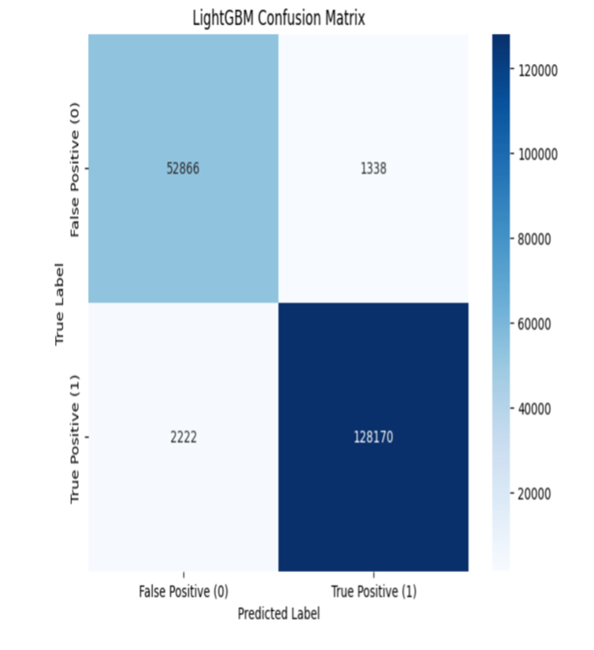

# AI-Parking-Space-Detector
# AI 기반 하이브리드 주차 공간 탐지 시스템 (AI-based Hybrid Parking Space Detection)

---

## 프로젝트 개요 (Project Overview)

본 프로젝트는 CCTV 영상에서 주차 공간의 빈 공간(space-empty)과 점유 공간(space-occupied)을 탐지하는 시스템입니다. YOLOv5를 사용하여 주차 공간 후보를 빠르게 탐지한 후, LightGBM을 이용하여 오탐을 제거하고 정확도를 높이는 하이브리드 방식으로 구현되었습니다.
This project is a hybrid system that detects parking spaces (space-empty and space-occupied) from CCTV footage. It first quickly identifies candidate parking spaces using YOLOv5, then applies LightGBM to filter false positives, enhancing overall accuracy.

- **1단계 (신속 탐지)**: YOLOv5로 빠르게 주차 공간 후보 영역 탐지.
- **2단계 (정밀 검증)**: LightGBM을 통해 후보 영역을 검증하여 최종 정확도 향상.

---

## 주요 성과 (Key Achievements)


| 단계 (Stage) | 지표 (Metric) | 성과 (Performance) |
| :---------------------- | :-------------------- | :---------- |
| YOLOv5 탐지 (Detection) | mAP@0.5 | 96.5% |
| LightGBM 검증 (Verification) | 정확도 (Accuracy) | 98.07% |
| 최종 시스템 (Final System) | 정밀도 (Precision) | 98.97% |
| 최종 시스템 (Final System) | 오탐률 (False Positive Rate) | 1.03% |

---
## 시각 자료 예시 (Visual Examples)

<p align="center">
  
  
</p>
<p align="center">
  <em>YOLOv5(좌)의 초기 탐지 성능과 LightGBM(우)의 최종 필터링 성능 비교 (혼동 행렬)</em>
</p>

---

## 기술 스택 (Tech Stack)

- Python 3.x
- PyTorch (YOLOv5)
- LightGBM
- Pandas, NumPy
- OpenCV
- Matplotlib, Seaborn

---

## 시스템 아키텍처 (System Architecture)

1. **입력 이미지**: CCTV 데이터
2. **YOLOv5 탐지**: 후보 영역 탐지
3. **LightGBM 검증**: 오탐 필터링
4. **최종 출력**: 정확히 검증된 주차 공간 결과

---

## 설치 및 환경 설정 (Installation & Setup)

```bash
git clone [YourRepoURL]
cd [YourRepositoryName]

python -m venv .venv
source .venv/bin/activate

pip install -U pip
pip install -r requirements.txt
```

---

## 데이터셋 준비(Dataset Preparation)

데이터셋 용량 문제로 GitHub에 직접 업로드하지 않았습니다. 아래 링크에서 다운로드하세요:
Due to its size, the dataset is hosted externally. Please download it from the link below:

👉 [주차 공간 탐지 데이터셋 다운로드 (Google Drive)](https://drive.google.com/drive/folders/1Uo_UL-IxjSNzQy145gA_pldgSvBvXu31?usp=sharing) 👈
👉 [Parking Space Detection Dataset Download (Google Drive)](https://drive.google.com/drive/folders/1Uo_UL-IxjSNzQy145gA_pldgSvBvXu31?usp=sharing) 👈
다운로드 후, 프로젝트 루트에 다음과 같은 구조로 데이터셋을 배치하세요:
Once downloaded, ensure the dataset is structured as follows at the project root:

```

parking-lot-detection/
├── train/
│   ├── images/
│   └── labels/
└── valid/
├── images/
└── labels/

```
---
## 사용 방법 (Usage / How to Run)

본 프로젝트의 주요 기능은 다음 두 가지 단계의 스크립트/Notebook 실행을 통해 완료할 수 있습니다. 각 실행 전, 필요한 경로 및 파라미터가 올바르게 설정되었는지 확인해주세요.

### 1. YOLOv5 탐지 결과 생성

LightGBM 모델 학습에 사용될 YOLOv5 예측 결과를 생성합니다. 이 단계에서 YOLOv5는 지정된 `--source` 경로의 이미지에 대해 예측을 수행하고, 예측 결과(`.txt` 파일)는 `--project`로 지정된 디렉토리에 저장됩니다. **생성된 이 예측 결과는 다음 단계의 LightGBM 파이프라인에서 사용됩니다.**

```bash
python detect.py \
  --weights /content/drive/MyDrive/yolov5_runs/exp_full_data_test12/weights/best.pt \
  --img 640 \
  --conf 0.25 \
  --source /content/drive/MyDrive/parking-lot-detection/train/images \
  --save-txt \
  --save-conf \
  --project yolo_preds \
  --name full_train_preds \
  --exist-ok
```

### 2. LightGBM 파이프라인 실행 (특징 추출, 학습 및 평가)

이 단계에서는 1단계에서 생성된 YOLOv5 예측 데이터를 기반으로, LightGBM 모델의 **특징 추출, 학습, 그리고 최종 하이브리드 시스템 평가**까지의 모든 과정을 자동으로 실행합니다. 이 모든 과정은 **제공된 Jupyter Notebook 파일**을 통해 진행됩니다.

**중요:** Notebook 실행 전, 해당 Notebook 파일 내에 하드코딩된 **다음 두 가지 경로 변수들이 사용자 환경의 실제 경로에 맞게 정확히 설정되어 있는지 반드시 확인해주세요:**

* `yolo_output_labels_folder`: 1단계에서 YOLOv5 예측 결과가 저장된 `.txt` 파일들의 정확한 폴더 경로. (예: `/content/drive/MyDrive/yolov5/yolo_preds/full_train_preds/labels/`)
* `ground_truth_labels_folder`: LightGBM 학습 및 평가에 사용될 원본 정답 레이블 파일들이 저장된 정확한 폴더 경로. (예: `/content/drive/MyDrive/parking-lot-detection/train/labels/`)

**실행 방법:**

프로젝트 루트 디렉토리에서 Jupyter Notebook을 실행합니다:

```bash
jupyter notebook
```
---

## 결과 요약 (Results Summary)

| 모델/시스템 단계        | 주요 지표                      | 달성 수치  | 비고                                                                 |
| :-------------------- | :----------------------------- | :--------- | :------------------------------------------------------------------- |
| 1단계: YOLOv5         | mAP@0.5                        | **96.5%** | 주차 공간(empty/occupied) 초기 탐지 성능                            |
| 2단계: LightGBM 필터  | 정탐/오탐 분류 정확도 (내부)   | **98.07%** | YOLOv5 예측 결과에 대한 분류 성능                                   |
| **최종 하이브리드 시스템** | **최종 예측 정밀도 (Precision)** | **98.97%** | LightGBM 필터링 후, 실제 정답 대비 최종 예측의 정확성               |
|                       | **최종 오탐 비율** | **1.03%** | LightGBM이 승인한 예측 중 실제 오탐 비율        |
|                       | 처리 속도 (FPS)                | **[측정값]** | (예: Intel i7 CPU / NVIDIA RTX 3060 환경에서 평균 XX FPS)           |

*(모든 수치는 제공된 데이터셋 및 실험 환경에서의 결과입니다.)*

---
## License / 라이선스

This project is licensed under the MIT License.

---

